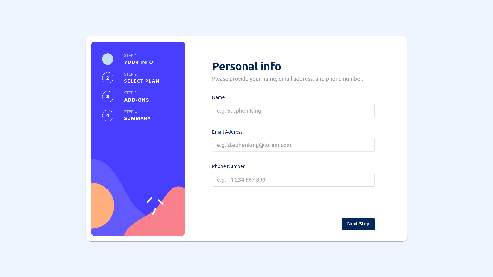

# Frontend Mentor - Multi-step form solution

This is a solution to the [Multi-step form challenge on Frontend Mentor](https://www.frontendmentor.io/challenges/multistep-form-YVAnSdqQBJ). Frontend Mentor challenges help you improve your coding skills by building realistic projects.

## Table of contents

- [Overview](#overview)
  - [The challenge](#the-challenge)
  - [Screenshot](#screenshot)
  - [Links](#links)
- [My process](#my-process)
  - [Built with](#built-with)
  - [What I learned](#what-i-learned)
- [Author](#author)

## Overview

### The challenge

Users should be able to:

- Complete each step of the sequence
- Go back to a previous step to update their selections
- See a summary of their selections on the final step and confirm their order
- View the optimal layout for the interface depending on their device's screen size
- See hover and focus states for all interactive elements on the page
- Receive form validation messages if:
  - A field has been missed
  - The email address is not formatted correctly
  - A step is submitted, but no selection has been made

### Screenshot

### Links

- Solution URL: [https://github.com/sjwhelpley/frontendmentor-multi-step-form](https://github.com/sjwhelpley/frontendmentor-multi-step-form)
- Live Site URL: [Add live site URL here](https://your-live-site-url.com)

## My process

### Built with

- [Vite](https://vitejs.dev/) - For bundling and development
- [TypeScript](https://www.typescriptlang.org/) - For types
- [React](https://reactjs.org/) - JS library
- [Redux Toolkit](https://redux-toolkit.js.org/) - State management
- [MUI](https://mui.com/) - For components and styles

### What I learned

I do not usually use TypeScript, so this was a good opportunity to work with it. I have a lot of experience with React and Redux, but not yet with adding in types. It added some extra complexity, but once I got the hang of it, I found it very beneficial to use.

This was good practice for customizing MUI components. Because of the particular design, I had more exposure than usual to adjusting these components and overriding theme defaults.

I also used this as practice for code organization and componentization. Over the course of development, I adjusted the codebase to be more modular and reduce code duplication - for example, I created a `StepTemplate` component that can be reused for each step of the form. This particularly helped to reduce duplication for the `Go Back` and `Next Step` buttons.

I also added a slice in the Redux store to handle the prices, so that they could easily be updated in one place. Though no reducers are needed in this frontend-only project where the prices are static, it mimics how the prices would be stored if connected to a backend.

## Author

- Website - [Samantha Whelpley](https://www.samwhelpley.me)
- Frontend Mentor - [@sjwhelpley](https://www.frontendmentor.io/profile/sjwhelpley)
